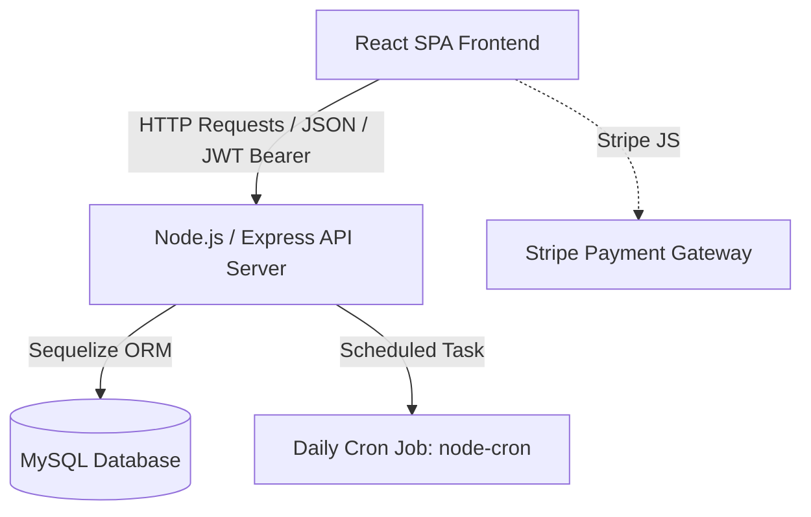
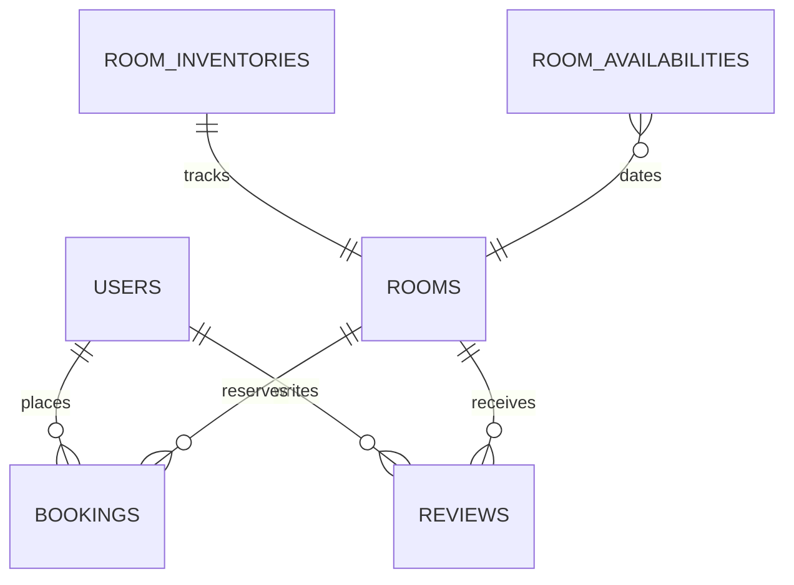

# Savoy Hotel Management System – Complete Technical Documentation

Welcome to the comprehensive technical documentation for the **Savoy Hotel Management System**. This document serves as a single source of truth for the entire application, detailing the system architecture, database schema, backend API, frontend structure, and setup instructions.

---

## Table of Contents

1. [System Architecture & Core Flows](#1-system-architecture--core-flows)
2. [Database Schema & Sequelize Models](#2-database-schema--sequelize-models)
3. [Backend API Reference](#3-backend-api-reference)
4. [Frontend Application Architecture](#4-frontend-application-architecture)
5. [Setup, Configuration, & Deployment](#5-setup-configuration--deployment)

---

## 1. System Architecture & Core Flows

The Savoy Hotel Management System is a full-stack, decoupled web application. It handles room browsing, real-time availability checks, user authentication, reservation booking, cart persistence, payment simulation, and administrator inventory management.

### Architecture Overview



### Core Business Logic Flows

#### A. Real-Time Room Availability Flow

Rather than performing slow queries across bookings, Savoy Hotel uses a high-performance availability matrix table (`roomavailabilities`):

1. When a user requests room availability for a date range `[checkInDate, checkOutDate)`:
   - The application retrieves the dates in between.
   - It queries `roomavailabilities` for the given `roomType` and dates.
   - If no record exists for a date, the database creates one on-the-fly via a Sequelize `findOrCreate` call, initializing the date with the max room type capacity from `roominventories`.
   - The system checks if the minimum `availableRooms` on any single date in the range is greater than or equal to the requested room quantity.
2. During booking creation (within a Sequelize Transaction):
   - Availability is re-checked to prevent race conditions.
   - If available, the system updates `roomavailabilities` for each date in the range, decrementing `availableRooms` and incrementing `bookedRooms` by the number of rooms booked.
   - The summary table `roominventories` is updated to decrement `availableRooms` as well.

#### B. Scheduled Booking & Inventory Release Flow

To handle checked-out guests automatically, a daily cron job runs at 1:00 AM server time (UTC):

1. The cron job queries the database for all bookings with a status of `"confirmed"` where the checkout date is before today (`checkOutDate < today`).
2. For each expired booking, it calls `inventoryService.releaseRooms`:
   - It updates the `roomavailabilities` table for the corresponding dates, incrementing `availableRooms` and decrementing `bookedRooms` (bounded by 0 and max capacity).
   - It increments `availableRooms` in `roominventories`.
3. It updates the booking status to `"completed"`.

---

## 2. Database Schema & Sequelize Models

Savoy Hotel utilizes MySQL. Database interactions are abstracted using Sequelize ORM.

### Entity Relationship Model



### Tables & Sequelize Schemas

#### A. Users (`users`)

Stores guest and administrator profiles.

- `id` (INTEGER, Primary Key, Auto Increment)
- `name` (STRING, Nullable: False)
- `email` (STRING, Unique: True, Nullable: False, Validation: Email Format)
- `password` (STRING, Hashed via bcryptjs, Nullable: False)
- `phone` (STRING, Nullable: True)
- `address` (STRING, Nullable: True)
- `city` (STRING, Nullable: True)
- `country` (STRING, Nullable: True)
- `zipCode` (STRING, Nullable: True)
- `role` (ENUM: `'user'`, `'admin'`, Default: `'user'`)
- `createdAt` / `updatedAt` (DATETIME)

_Sequelize Hooks_:

- `beforeCreate`: Hashes the password with salt factor 10 using `bcrypt.hash()`.
- _Method_: `User.prototype.matchPassword(enteredPassword)` compares typed passwords to the database hash.

#### B. Rooms (`rooms`)

Represents the general room details/descriptions.

- `id` (INTEGER, Primary Key, Auto Increment)
- `name` (STRING, Nullable: False)
- `description` (TEXT, Nullable: False)
- `price` (DECIMAL(10,2), Nullable: False, Validation: Minimum 0)
- `mainImage` (STRING, Nullable: False)
- `images` (TEXT, getter returns parsed JSON array, setter saves serialized string)
- `type` (ENUM: `'exclusive'`, `'family'`, `'deluxe'`, `'panoramic'`, `'presidential'`, `'honeymoon'`, Nullable: False)
- `adultCapacity` (INTEGER, Nullable: False, Validation: Minimum 1)
- `childrenCapacity` (INTEGER, Default: 0)
- `features` (TEXT, getter returns parsed JSON array, setter saves serialized string)
- `rating` (FLOAT, Default: 0, Validation: 0 to 5)
- `numReviews` (INTEGER, Default: 0)
- `availability` (BOOLEAN, Default: True)
- `size` (INTEGER, Nullable: False)
- `beds` (STRING, Nullable: False)
- `createdAt` / `updatedAt` (DATETIME)

#### C. Bookings (`bookings`)

Records active reservations.

- `id` (INTEGER, Primary Key, Auto Increment)
- `userId` (INTEGER, Foreign Key, references `users.id`, onDelete: SET NULL)
- `roomId` (INTEGER, Foreign Key, references `rooms.id`, onDelete: SET NULL)
- `checkInDate` (DATEONLY, Nullable: False)
- `checkOutDate` (DATEONLY, Nullable: False)
- `numberOfAdults` (INTEGER, Nullable: False, Validation: Minimum 1)
- `numberOfChildren` (INTEGER, Default: 0)
- `numberOfRooms` (INTEGER, Nullable: False, Validation: Minimum 1)
- `totalPrice` (DECIMAL(10,2), Nullable: False, Validation: Minimum 0)
- `specialRequests` (TEXT, Nullable: True)
- `status` (ENUM: `'pending'`, `'confirmed'`, `'cancelled'`, `'completed'`, Default: `'pending'`)
- `paymentStatus` (ENUM: `'pending'`, `'paid'`, `'refunded'`, Default: `'pending'`)
- `paymentMethod` (ENUM: `'credit'`, `'payAtHotel'`, Default: `'credit'`)
- `guestName` (STRING, Nullable: True)
- `guestEmail` (STRING, Nullable: True)
- `guestPhone` (STRING, Nullable: True)
- `guestAddress` (STRING, Nullable: True)
- `guestCity` (STRING, Nullable: True)
- `guestCountry` (STRING, Nullable: True)
- `guestZipCode` (STRING, Nullable: True)
- `pricePerNight` (DECIMAL(10,2), Nullable: True)
- `numberOfNights` (INTEGER, Nullable: True)
- `createdAt` / `updatedAt` (DATETIME)

#### D. Reviews (`reviews`)

Maintains reviews submitted by users.

- `id` (INTEGER, Primary Key, Auto Increment)
- `rating` (INTEGER, Nullable: False, Validation: 1 to 5)
- `comment` (TEXT, Nullable: False)
- `name` (STRING, Nullable: False)
- `email` (STRING, Nullable: False, Validation: Email Format)
- `userId` (INTEGER, Foreign Key, references `users.id`, onDelete: CASCADE)
- `roomId` (INTEGER, Foreign Key, references `rooms.id`, onDelete: CASCADE)
- `createdAt` / `updatedAt` (DATETIME)

_Sequelize Hooks_:

- `afterCreate` / `afterUpdate` / `afterDestroy`: Recalculates average `rating` and count of `numReviews` for the associated `roomId`, updating the corresponding record in `rooms` automatically.

#### E. Contacts (`contacts`)

Tracks guest inquiries submitted via the Contact Us form.

- `id` (INTEGER, Primary Key, Auto Increment)
- `name` (STRING, Nullable: False)
- `email` (STRING, Nullable: False, Validation: Email Format)
- `subject` (STRING, Nullable: False)
- `message` (TEXT, Nullable: False)
- `status` (ENUM: `'pending'`, `'read'`, `'responded'`, Default: `'pending'`)
- `createdAt` / `updatedAt` (DATETIME)

#### F. Room Inventories (`roominventories`)

Maintains hotel capacity data per room type.

- `id` (INTEGER, Primary Key, Auto Increment)
- `roomType` (STRING, Nullable: False, Validation: Not Empty)
- `totalRooms` (INTEGER, Nullable: False, Validation: Minimum 0)
- `availableRooms` (INTEGER, Nullable: False, Validation: Minimum 0)
- `createdAt` / `updatedAt` (DATETIME)

#### G. Room Availabilities (`roomavailabilities`)

Tracks day-by-day counts of booked and available rooms.

- `id` (INTEGER, Primary Key, Auto Increment)
- `roomType` (STRING, Nullable: False)
- `date` (DATEONLY, Nullable: False)
- `bookedRooms` (INTEGER, Nullable: False, Default: 0)
- `availableRooms` (INTEGER, Nullable: False)
- `createdAt` / `updatedAt` (DATETIME)

_Indexes_:

- `unique_room_date` (Unique Index on fields `["roomType", "date"]`)

---

## 3. Backend API Reference

The backend API server runs Express.js. Middlewares manage request filtering, error propagation, and role authorization.

### Backend Middlewares

1. **authMiddleware.js**
   - `protect`: Reads the `Authorization` header (`Bearer <token>`). Verifies the token using `jsonwebtoken` and `JWT_SECRET`. Resolves the user's ID, and appends `req.user = { id, role }` to the request object. Returns `401 Unauthorized` if validation fails.
   - `admin`: Checks if `req.user.role === 'admin'`. If not, returns `403 Forbidden` ("Admin privileges required").

2. **validate.js**
   - Integrates payload validations on incoming API routes to ensure requests match expected database structures.

3. **errorHandler.js**
   - Global Express error middleware. Catches unhandled errors, formats stack traces, logs issues to console, and sends standard JSON payloads to clients containing sanitized error logs.

---

### Endpoint Reference

All backend API routes are prefixed with `/api`.

#### A. Authentication & Users (`/api/users`)

| Method     | Endpoint             | Access     | Headers                         | Payload                                                             | Description                                                 |
| :--------- | :------------------- | :--------- | :------------------------------ | :------------------------------------------------------------------ | :---------------------------------------------------------- |
| **POST**   | `/api/users`         | Public     | None                            | `{ name, email, password, phone, address, city, country, zipCode }` | Register a new user profile. Returns user info + JWT token. |
| **POST**   | `/api/users/login`   | Public     | None                            | `{ email, password }`                                               | Authenticate user. Returns user data + JWT token.           |
| **GET**    | `/api/users/profile` | Private    | `Authorization: Bearer <token>` | None                                                                | Retrieve authenticated user profile (excluding password).   |
| **PUT**    | `/api/users/profile` | Private    | `Authorization: Bearer <token>` | `{ name, email, password, phone, address, city, country, zipCode }` | Update user profile. Password values hash on save.          |
| **GET**    | `/api/users`         | Admin Only | `Authorization: Bearer <token>` | None                                                                | Retrieve list of all registered users.                      |
| **GET**    | `/api/users/:id`     | Admin Only | `Authorization: Bearer <token>` | None                                                                | Get specific user profile.                                  |
| **PUT**    | `/api/users/:id`     | Admin Only | `Authorization: Bearer <token>` | `{ name, email, role, phone, address, ... }`                        | Update profile properties of a specific user.               |
| **DELETE** | `/api/users/:id`     | Admin Only | `Authorization: Bearer <token>` | None                                                                | Delete a user account from database.                        |

#### B. Rooms (`/api/rooms`)

| Method     | Endpoint                        | Access     | Headers                         | Payload                                          | Description                                                      |
| :--------- | :------------------------------ | :--------- | :------------------------------ | :----------------------------------------------- | :--------------------------------------------------------------- |
| **GET**    | `/api/rooms`                    | Public     | None                            | Query params (optional filters)                  | Retrieve list of all hotel rooms.                                |
| **POST**   | `/api/rooms/check-availability` | Public     | None                            | `{ roomType, checkInDate, checkOutDate, rooms }` | Verify room count availability for dates.                        |
| **GET**    | `/api/rooms/with-availability`  | Public     | None                            | Query: `?checkIn=YYYY-MM-DD&checkOut=YYYY-MM-DD` | Get list of rooms with their availability status for date range. |
| **GET**    | `/api/rooms/:id`                | Public     | None                            | None                                             | Retrieve full details of a specific room.                        |
| **POST**   | `/api/rooms`                    | Admin Only | `Authorization: Bearer <token>` | Room schema json                                 | Create a new room card.                                          |
| **PUT**    | `/api/rooms/:id`                | Admin Only | `Authorization: Bearer <token>` | Room schema updates                              | Modify room details.                                             |
| **DELETE** | `/api/rooms/:id`                | Admin Only | `Authorization: Bearer <token>` | None                                             | Remove room.                                                     |

#### C. Bookings (`/api/bookings`)

| Method   | Endpoint                     | Access     | Headers                         | Payload                                                                                                                                                     | Description                                                          |
| :------- | :--------------------------- | :--------- | :------------------------------ | :---------------------------------------------------------------------------------------------------------------------------------------------------------- | :------------------------------------------------------------------- |
| **POST** | `/api/bookings`              | Private    | `Authorization: Bearer <token>` | `{ roomId, checkInDate, checkOutDate, numberOfGuests, numberOfRooms, guestName, guestEmail, guestPhone, address, city, country, zipCode, totalPrice, ... }` | Create a booking, deduct inventory, lock dates.                      |
| **GET**  | `/api/bookings`              | Admin Only | `Authorization: Bearer <token>` | None                                                                                                                                                        | Fetch all bookings.                                                  |
| **GET**  | `/api/bookings/mybookings`   | Private    | `Authorization: Bearer <token>` | None                                                                                                                                                        | Fetch all bookings placed by logged-in user.                         |
| **GET**  | `/api/bookings/:id`          | Private    | `Authorization: Bearer <token>` | None                                                                                                                                                        | Fetch single booking detail. Blocked for other users.                |
| **PUT**  | `/api/bookings/:id/pay`      | Private    | `Authorization: Bearer <token>` | None                                                                                                                                                        | Mark booking payment status as `"paid"` and status as `"confirmed"`. |
| **PUT**  | `/api/bookings/:id/cancel`   | Private    | `Authorization: Bearer <token>` | None                                                                                                                                                        | Cancel booking and release reserved dates back to inventory.         |
| **PUT**  | `/api/bookings/:id/status`   | Admin Only | `Authorization: Bearer <token>` | `{ status }`                                                                                                                                                | Modify booking status manually.                                      |
| **PUT**  | `/api/bookings/:id/complete` | Admin Only | `Authorization: Bearer <token>` | None                                                                                                                                                        | Mark booking as completed and release remaining dates.               |

#### D. Reviews (`/api/reviews`)

| Method     | Endpoint                    | Access         | Headers                         | Payload                                            | Description                                                    |
| :--------- | :-------------------------- | :------------- | :------------------------------ | :------------------------------------------------- | :------------------------------------------------------------- |
| **GET**    | `/api/reviews`              | Public         | None                            | None                                               | Fetch all hotel reviews.                                       |
| **GET**    | `/api/reviews/room/:roomId` | Public         | None                            | None                                               | Fetch all reviews left on a specific room.                     |
| **POST**   | `/api/reviews`              | Private/Public | None / JWT Token                | `{ name, email, rating, comment, roomId, userId }` | Create a review on a room. Triggers rating updates in `rooms`. |
| **PUT**    | `/api/reviews/:id`          | Admin Only     | `Authorization: Bearer <token>` | Review properties                                  | Update reviews (rating updates trigger in hook).               |
| **DELETE** | `/api/reviews/:id`          | Admin Only     | `Authorization: Bearer <token>` | None                                               | Remove a review. Rating updates trigger in hook.               |

#### E. Inventory Management (`/api/inventory`)

| Method  | Endpoint                                | Access     | Headers                         | Payload                                            | Description                                           |
| :------ | :-------------------------------------- | :--------- | :------------------------------ | :------------------------------------------------- | :---------------------------------------------------- |
| **GET** | `/api/inventory`                        | Admin Only | `Authorization: Bearer <token>` | None                                               | Get overall inventory totals and counts.              |
| **GET** | `/api/inventory/status`                 | Admin Only | `Authorization: Bearer <token>` | None                                               | Get inventory status with today's availability.       |
| **GET** | `/api/inventory/availability`           | Public     | None                            | Query: `?checkInDate=...&checkOutDate=...`         | Get available capacities for all room types in range. |
| **GET** | `/api/inventory/:roomType/availability` | Public     | None                            | Query: `?checkInDate=...&checkOutDate=...&rooms=1` | Get availability flag for specific type in range.     |

---

## 4. Frontend Application Architecture

The frontend is a Single Page Application (SPA) built using React.js. It manages routing via React Router and global state via React Contexts.

### Directory Structure

```text
frontend/src/
├── components/          # Reusable UI widgets and layout modules
│   ├── AdminInventoryDashboard.js     # Administrative analytics panel
│   ├── BookingForm.js                 # Cart and booking payload validator
│   ├── RoomAvailability.js            # Date range availability query form
│   ├── Header.js / Footer.js          # Shared shell UI components
│   └── ErrorBoundary.js               # Error fallback component
├── context/             # React Context Providers
│   ├── AuthContext.js                 # User login status, details, profile
│   └── CartContext.js                 # Shopping cart state, localStorage synchronization
├── pages/               # Route endpoints
│   ├── Home.js                        # Homepage slide deck and hotel description
│   ├── About.js                       # Hotel summary, story, features
│   ├── Rooms.js                       # Room card filters and detail modals
│   ├── Reservation.js                 # Step-based room configurations
│   ├── Cart.js                        # Reservation cart overview and items list
│   ├── Checkout.js                    # Cart summary, guest details form, Stripe simulator
│   ├── SignIn.js / SignUp.js          # Forms for login/registration
│   ├── Reviews.js                     # Global list of reviews
│   └── Faq.js                         # Dynamic Accordion FAQ list
├── utils/               # Axios/Fetch clients and inventory logic
│   ├── api.js                         # Global API service definition
│   └── inventoryManager.js            # Offline local reservation helper
├── App.js               # Main Router config & context wrappers
└── index.js             # Root mounting file
```

### Global State & Persistent Storage

- **AuthContext.js**: Coordinates JWT token storage, user registers, logins, and logouts.
  - State fields: `user`, `loading`, `isAuthenticated`.
  - Side effects: Stores token in `localStorage.getItem('token')`. Automatically requests `/api/users/profile` on application mount if token is found.
- **CartContext.js**: Manages rooms in the booking cart.
  - State: `cartItems` (array of rooms with unique `cartItemId`, checkin/checkout dates, requested room counts, pricing).
  - Side effects: Syncs changes automatically to `localStorage.setItem('cartItems', JSON.stringify(cartItems))`.
  - Methods: `addToCart(room)`, `removeFromCart(cartItemId)`, `updateQuantity(cartItemId, updates)`, `clearCart()`, `getCartTotal()`.

### Routing configuration & Route Guards

- **ScrollToTop Utility**: A component that triggers `window.scrollTo({ top: 0, behavior: 'instant' })` whenever React Router's `pathname` changes to guarantee pages load at the top.
- **ProtectedRoute Route Guard**: Protects pages like `/reservation` and `/checkout`:
  - Checks `loading` from `AuthContext`. If true, displays a loader spinner.
  - Checks `isAuthenticated`. If false, redirects users to `/signin` with `location` passed in the navigation state (so they are automatically returned to their target page after a successful sign-in).

---

## 5. Setup, Configuration, & Deployment

### Project Dependencies

- **Backend**: Express, CORS, Helmet (security headers), Compression, Sequelize (ORM), mysql2 (MySQL driver), bcryptjs (password hashing), jsonwebtoken (JWT), express-rate-limit (API rate-limiting), node-cron (scheduled task manager).
- **Frontend**: React, React Router DOM, Axios, standard CSS utilities.

### Step-by-Step Local Setup

#### Prerequisites

- Node.js (v16.x or newer recommended)
- MySQL Server (v8.0 or newer) running locally or remotely

#### 1. Clone & Core Setup

```bash
git clone <repository-url>
cd Hotel-website
```

#### 2. Database Server Configurations

Create a blank MySQL schema database named `savoy_hotel` or configure Sequelize to initialize it automatically:

```sql
CREATE DATABASE savoy_hotel;
```

#### 3. Backend Dependencies & Database Seeding

Navigate to the backend directory, install files, run migrations, and start the hot-reloading dev server:

```bash
cd backend
npm install

# Run database setup scripts (creates structures + seeds admin, rooms, inventories, availability calendars)
npx sequelize-cli db:create
npm run migrate
npm run seed

# Start server
npm run dev
```

_Note_: The API server runs at `http://localhost:5000`.

#### 4. Frontend Environment Configurations

Create a file named `.env` in the `frontend/` directory:

```env
REACT_APP_API_URL=http://localhost:5000/api
```

#### 5. Frontend Dependencies & Build

Open a new terminal window, navigate to the frontend directory, install modules, and boot up the development server:

```bash
cd ../frontend
npm install
npm start
```

_Note_: The browser window will open automatically at `http://localhost:3000`.

### Database Seeding Details

When database seeds are initialized:

- A default administrator account is generated:
  - **Email**: `admin@savoyhotel.com`
  - **Password**: `admin123`
- The system automatically populates the `rooms` table with six pre-configured room types (Deluxe Room, Family Suite, Presidential Suite, Honeymoon Suite, Panoramic View Room, Exclusive Suite) complete with capacities, prices, and features.
- Daily availability is automatically mapped out 365 days in advance inside the database.

---

### Troubleshooting Common Issues

1. **CORS Blocks (`Not allowed by CORS`)**:
   Ensure the frontend URL matches the origins defined in `CORS_ORIGINS` in your backend `.env`. In production, keep this restricted to the host domain.

2. **MySQL Database Connection Failures**:
   Ensure MySQL service is running. Double-check your host name, port (default: 3306), database credentials, and that database `savoy_hotel` is created prior to starting the server.

3. **Database is still initializing (503 Service Unavailable)**:
   This happens if the server boots up before Sequelize has finished running migrations or mapping out 365 days of availability calendar. Wait a moment and refresh.

4. **Stripe Simulator fails on checkout**:
   Check backend console log outputs. If you use mock parameters, ensure price values are numeric. Ensure request payloads are sent with `Authorization: Bearer <token>` in headers.
